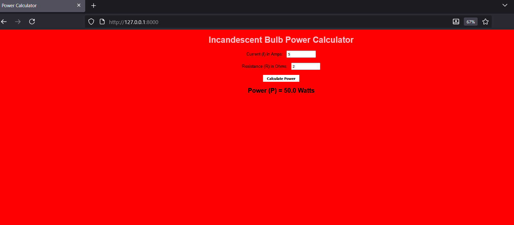

# Ex.05 Design a Website for Server Side Processing
## Date:08/10/25

## AIM:
 To design a website to calculate the power of a lamp filament in an incandescent bulb in the server side. 


## FORMULA:
P = I<sup>2</sup>R
<br> P --> Power (in watts)
<br> I --> Intensity
<br> R --> Resistance

## DESIGN STEPS:

### Step 1:
Clone the repository from GitHub.

### Step 2:
Create Django Admin project.

### Step 3:
Create a New App under the Django Admin project.

### Step 4:
Create python programs for views and urls to perform server side processing.

### Step 5:
Create a HTML file to implement form based input and output.

### Step 6:
Publish the website in the given URL.

## PROGRAM :
```
math.html

<!DOCTYPE html>
<html>
<head>
    <title>Power Calculator</title>
    <style>
        body {
    background-color: red;
    font-family: Arial, sans-serif;
    text-align: center;
}

.container {
    background-color: blue;
    border: 5px dashed green;
    width: 400px;
    padding: 30px;
    margin: 100px auto;
    color: white;
    border-radius: 10px;
}

h1 {
    color: pink;
}

input[type="text"] {
    width: 100px;
    padding: 5px;
    margin-left: 10px;
}

input[type="submit"] {
    padding: 5px 15px;
    background-color: white;
    border: none;
    cursor: pointer;
    font-weight: bold;
}

input[type="submit"]:hover {
    background-color: lightgray;
}

    </style>
</head>
<body>
    <h1>Incandescent Bulb Power Calculator</h1>

    <form method="post">
        
        <label for="current">Current (I) in Amps:</label>
        <input type="text" id="current" name="current" required><br><br>

        <label for="resistance">Resistance (R) in Ohms:</label>
        <input type="text" id="resistance" name="resistance" required><br><br>

        <input type="submit" value="Calculate Power">
    </form>

    
        <h2>Power (P) = {{ result }} Watts</h2>
    

    
        <p style="color: red;">{{ error }}</p>
    
</body>
</html>


views.py

from django.shortcuts import render

def calculate_power(request):
    result = None
    error = None

    if request.method == 'POST':
        try:
            current = float(request.POST.get('current'))
            resistance = float(request.POST.get('resistance'))
            power = (current ** 2) * resistance
            result = round(power, 2)
        except (ValueError, TypeError):
            error = "Invalid input. Please enter valid numbers."

    return render(request, 'mathapp/math.html', {'result': result, 'error': error})

mathapp/urls.py

from django.urls import path
from . import views

urlpatterns = [
    path('', views.calculate_power, name='calculate_power'),
]

rithesh/urls.py

from django.urls import path
from . import views

urlpatterns = [
    path('', views.calculate_power, name='calculate_power'),
]

```

## SERVER SIDE PROCESSING:


## HOMEPAGE:


## RESULT:
The program for performing server side processing is completed successfully.
